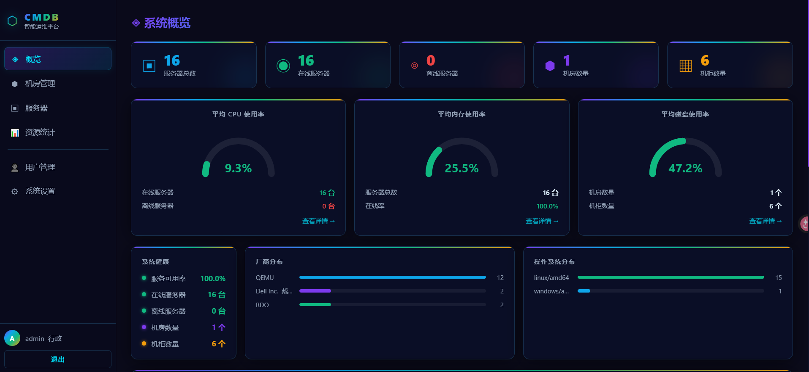
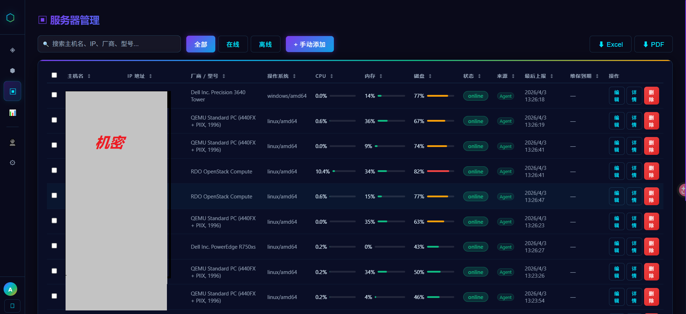
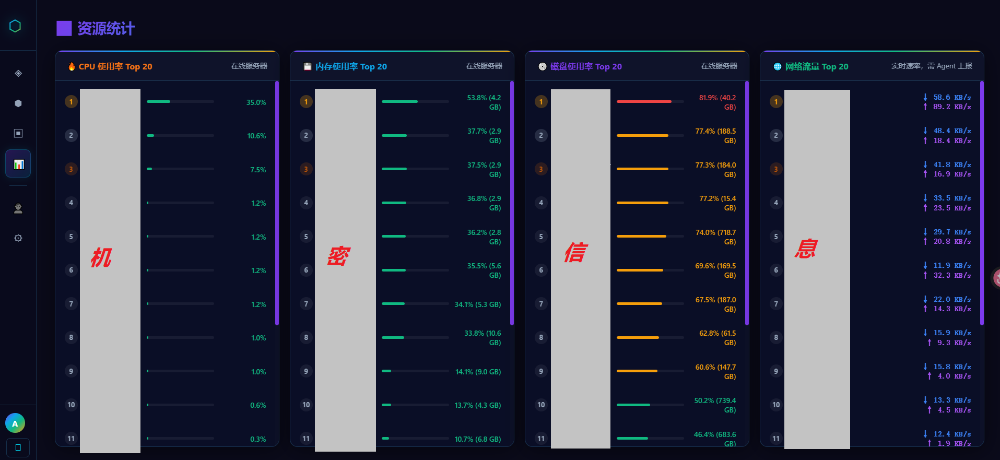
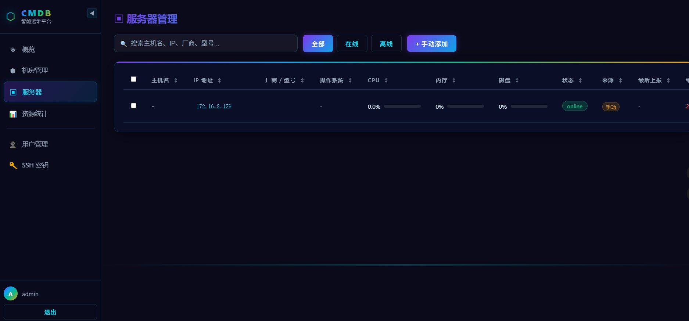
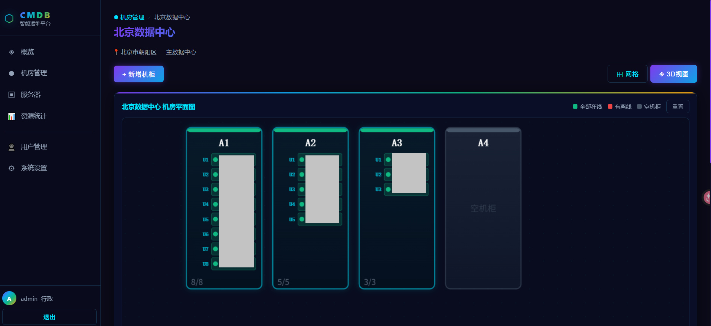
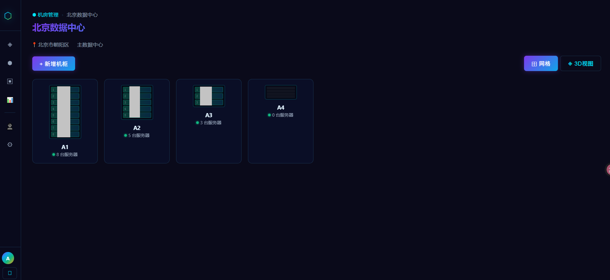

# CMDB 智能运维平台

> 基于 Go + Vue 3 的现代化 CMDB 系统，深色科技风 UI，支持 Agent 自动采集、Web SSH/RDP、机房可视化等功能。

---

## 系统截图

| 概览仪表盘 | 服务器管理 |
|:---:|:---:|
|  |  |

| 资源统计 | Web SSH 终端 |
|:---:|:---:|
|  | |

| 机房 3D 视图 | 平面视图 |
|:---:|:---:|
|  |  |

---

## 功能介绍

### 🖥 服务器管理
- 支持 Agent 自动上报注册，也可手动录入
- 字段覆盖：主机名、IP、厂商/型号、OS、CPU、内存、磁盘、网络流量、Agent 版本
- 支持关键字搜索、在线/离线筛选、多列排序（CPU、内存、磁盘、维保到期等）
- 管理员可编辑、删除（单个或批量多选删除），普通用户只读
- 维保到期日期管理，临期 30 天橙色预警，已过期红色告警

### 🏢 机房 & 机柜管理
- 多机房管理，支持新增/删除机房和机柜
- 机柜网格视图：按 U 位号展示服务器实际位置，在线绿色/离线红色
- 机柜 3D 平面图：可拖拽调整机柜布局，支持保存位置
- 服务器可关联到指定机房 → 机柜 → U 位号
- 机柜内支持一键添加/移出服务器

### 🔗 远程连接
- **Web SSH**：点击 IP 直接在浏览器内打开终端，支持密钥/密码认证，自动降级
- **RDP 连接**（Windows 机器）：点击 IP 下载 .rdp 配置文件，双击使用本地客户端连接，性能最佳
- SSH 全局密钥配置，自动登录 Linux 机器

### 📊 资源统计
- 全局服务器在线率、CPU/内存/磁盘平均使用率
- 厂商分布、OS 分布饼图（ECharts）
- 离线服务器列表

### 👤 用户管理（管理员）
- 新增/编辑/删除用户，支持管理员/普通用户角色
- 为普通用户分配可访问的服务器白名单

### 🤖 Agent 自动采集
- 跨平台（Linux / Windows），单二进制无依赖
- 采集项：主机名、IP（智能过滤虚拟网卡）、CPU、内存、磁盘、网络流量、厂商、型号、OS
- 手动录入的机器不会被 Agent 覆盖

---

## 技术栈

| 层级 | 技术 |
|------|------|
| 后端 | Go 1.25 · Gin · GORM · SQLite · JWT |
| 前端 | Vue 3 · Vite · ECharts · xterm.js |
| Agent | Go（跨平台编译） |
| 部署 | Docker · Docker Compose |

---

## 本地开发

### 后端

```bash
cd backend
go mod tidy
go run .
# 监听 :8088，首次启动自动创建 SQLite 数据库和 admin 账号
```

### 前端

```bash
cd frontend
npm install
npm run dev
# 访问 http://localhost:3000
```

---

## Docker 部署（推荐）

### 前提

服务器上安装 Docker 和 Docker Compose：

```bash
curl -fsSL https://get.docker.com | sh
sudo usermod -aG docker $USER
sudo apt install -y docker-compose-plugin
docker compose version
```

### 一键启动

```bash
# 下载代码到服务器
cd opt
git clone https://github.com/tao9221/cmdb.git

cd /opt/cmdb

# 构建并启动（首次需要几分钟编译）
docker compose up -d --build

# 查看日志
docker compose logs -f

# 访问 http://服务器IP:8088
```

### 常用命令

```bash
docker compose down          # 停止
docker compose restart       # 重启
docker compose up -d --build # 更新重建
docker compose ps            # 查看状态
docker exec -it cmdb sh      # 进入容器
```

### 数据持久化

SQLite 数据库存储在 Docker volume `cmdb_data` 中，容器删除后数据不丢失。

```bash
# 备份
docker cp cmdb:/app/data/cmdb.db ./cmdb_backup.db

# 恢复
docker cp ./cmdb_backup.db cmdb:/app/data/cmdb.db
docker compose restart
```

---

## 生产部署（Ubuntu 直接运行）

### 1. 安装依赖

```bash
sudo apt update
sudo apt install -y gcc git curl

# Go
wget https://go.dev/dl/go1.25.0.linux-amd64.tar.gz
sudo tar -C /usr/local -xzf go1.25.0.linux-amd64.tar.gz
echo 'export PATH=$PATH:/usr/local/go/bin' >> ~/.bashrc
source ~/.bashrc

# Node.js
curl -fsSL https://deb.nodesource.com/setup_20.x | sudo -E bash -
sudo apt install -y nodejs
```

### 2. 构建 & 运行

```bash
# 构建前端
cd /opt/cmdb/frontend
npm install && npm run build
cp -r dist /opt/cmdb/backend/dist

# 构建后端
cd /opt/cmdb/backend
go build -o cmdb-backend .
./cmdb-backend
# 访问 http://服务器IP:8088
```

### 3. systemd 开机自启

```bash
sudo tee /etc/systemd/system/cmdb.service > /dev/null <<EOF
[Unit]
Description=CMDB Service
After=network.target

[Service]
WorkingDirectory=/opt/cmdb/backend
ExecStart=/opt/cmdb/backend/cmdb-backend
Restart=always
RestartSec=5

[Install]
WantedBy=multi-user.target
EOF

sudo systemctl daemon-reload
sudo systemctl enable --now cmdb
```

### 4. Nginx 反代（可选）

```nginx
server {
    listen 80;
    server_name your_domain_or_ip;

    location / {
        proxy_pass http://127.0.0.1:8088;
        proxy_http_version 1.1;
        proxy_set_header Upgrade $http_upgrade;
        proxy_set_header Connection "upgrade";
        proxy_set_header Host $host;
        proxy_read_timeout 3600s;
    }
}
```

---

## Agent 部署

### 编译

```bash
cd agent

# Linux
go build -o cmdb-agent .

# Windows
GOOS=windows GOARCH=amd64 go build -o cmdb-agent.exe .
```

### 运行

```bash
# Linux
./cmdb-agent -server http://CMDB服务器IP:8088 -interval 60

# Windows（PowerShell）
.\cmdb-agent.exe -server http://CMDB服务器IP:8088 -interval 60
```

| 参数 | 说明 | 默认值 |
|------|------|--------|
| `-server` | CMDB 后端地址 | `http://localhost:8080` |
| `-interval` | 上报间隔（秒） | `60` |

### systemd 自启（Linux）

```bash
sudo tee /etc/systemd/system/cmdb-agent.service > /dev/null <<EOF
[Unit]
Description=CMDB Agent
After=network.target

[Service]
ExecStart=/opt/cmdb-agent -server http://CMDB服务器IP:8088 -interval 60
Restart=always
RestartSec=10

[Install]
WantedBy=multi-user.target
EOF

sudo systemctl daemon-reload
sudo systemctl enable --now cmdb-agent
```

> 手动录入的机器不会被 Agent 覆盖，状态永远保持在线。

---

## 默认账号

首次启动自动创建：

| 用户名 | 密码 | 角色 |
|--------|------|------|
| admin | admin123 | 管理员 |

**请登录后立即修改密码。**

---

## 端口说明

| 端口 | 用途 |
|------|------|
| 8088 | CMDB 后端 + 前端静态文件 |
| 3000 | 前端开发服务器（仅开发环境） |
